# Book-Anchored Progressive Curriculum: Calculus → Analysis (DAG)

## TL;DR
- A verified 26-node DAG runs from algebra readiness (Miller/O'Neill/Hyde) to research-level graduate sinks (Stein–Shakarchi *Functional Analysis*; Brezis *Functional Analysis, Sobolev Spaces and PDE*), extending well past both Rudin texts.
- Rudin *Principles* (Tier 5) and Rudin *Real and Complex* (Tier 6) are interior nodes; the graph continues into measure theory, functional analysis, operator/distribution theory and Sobolev/PDE.
- The single largest structural gap is the leap into proof; a dedicated transition text (Velleman) plus a gentle first-analysis tier (Ross/Abbott/Spivak) closes it with high seam overlap.

## 1. Tier scheme (derived from stated prerequisites, series placement, and reviews)
- **Tier 0 — Algebra & precalculus readiness.** Real numbers, factoring, functions, trig, logs. Computational.
- **Tier 1 — Computational single-variable calculus.** Limits, derivatives, integrals, series. Computational.
- **Tier 2 — Rigorous/advanced calculus with linear algebra.** Proofs of calculus theorems, vector calculus, intro linear algebra. Mixed→proof.
- **Tier 3 — Transition to proof.** Logic, sets, relations, induction. Proof-based, no analysis content.
- **Tier 4 — Introductory rigorous analysis + abstract linear algebra.** Rigorous single-variable analysis; limits/continuity via ε-δ; abstract vector spaces. Proof-based.
- **Tier 5 — Undergraduate real analysis & advanced multivariable analysis.** Metric spaces, uniform convergence, multivariable/differential forms. Proof-based.
- **Tier 6 — Graduate real & complex analysis.** Lebesgue measure/integration, Lᵖ, elementary functional analysis, complex function theory. Proof-based, high maturity.
- **Tier 7 — Advanced graduate analysis.** Abstract measure, point-set topology, functional analysis, distributions. Research-adjacent.
- **Tier 8 — Research-level sinks.** Functional analysis with probability/several complex variables/oscillatory integrals; Sobolev spaces and PDE.

## 2. Node catalogue

| id | title | author(s) | ed. | year | publisher | tier | rigor | role | tags |
|---|---|---|---|---|---|---|---|---|---|
| N01 | Intermediate Algebra | Miller, O'Neill, Hyde | 6th | 2022 | McGraw Hill | 0 | computational | Algebra-readiness source node | [VERIFIED] |
| N02 | Precalculus: Mathematics for Calculus | Stewart, Redlin, Watson | 7th | 2016 | Cengage | 0 | computational | Functions/trig bridge into calculus | [VERIFIED] |
| N03 | Fast Start Differential Calculus | Ashlock | 1st | 2019 | Morgan & Claypool | 1 | computational | Fast on-ramp: derivatives | [VERIFIED] |
| N04 | Fast Start Integral Calculus | Ashlock | 1st | 2019 | Morgan & Claypool | 1 | computational | Fast on-ramp: integrals | [VERIFIED] |
| N05 | Fast Start Advanced Calculus | Ashlock | 1st | 2019 | Morgan & Claypool | 1 | computational | Fast on-ramp: multivariable/series | [VERIFIED] |
| N06 | Calculus | Stewart, Clegg, Watson | 9th | 2020 (©2021) | Cengage | 1 | computational | Standard single/multivariable calculus | [VERIFIED] |
| N07 | Calculus: Concepts and Contexts | Stewart, Kokoska | 5th | 2023 | Cengage | 1 | computational | Concepts-first calculus (Stewart sibling) | [VERIFIED] |
| N08 | Calculus, Vols. 1–2 | Apostol | 2nd | 1967 (Vol 1) / 1969 (Vol 2) | Wiley | 2 | proof-based | Rigorous calculus + intro linear algebra | [VERIFIED] |
| N18 | Advanced Calculus | Woods (F. S.) | new ed. | 1934 (1st 1926) | Ginn | 2 | mixed | Classic advanced calculus (dropped) | [VERIFIED] |
| N09 | How to Prove It | Velleman | 3rd | 2019 | Cambridge | 3 | proof-based | Transition-to-proof bridge | [VERIFIED] |
| N10 | Calculus | Spivak | 4th | 2008 | Publish or Perish | 4 | proof-based | Rigorous single-variable calculus | [VERIFIED] |
| N11 | Elementary Analysis: The Theory of Calculus | Ross (López, 2nd ed.) | 2nd | 2013 | Springer | 4 | proof-based | Gentlest first real analysis | [VERIFIED] |
| N12 | Understanding Analysis | Abbott | 2nd | 2015 | Springer | 4 | proof-based | Motivated single-variable real analysis | [VERIFIED] |
| N13 | Linear Algebra Done Right | Axler | 4th | 2024 | Springer | 4 | proof-based | Abstract linear algebra (supporting; open-access) | [VERIFIED] |
| N14 | Principles of Mathematical Analysis | Rudin | 3rd | 1976 | McGraw-Hill | 5 | proof-based | Canonical undergraduate real analysis | [VERIFIED] |
| N15 | Real Mathematical Analysis | Pugh | 2nd | 2015 | Springer | 5 | proof-based | Picture-driven undergraduate analysis (Rudin sibling) | [VERIFIED] |
| N16 | Vector Calculus, Linear Algebra, and Differential Forms | Hubbard & Hubbard | 5th | 2015 | Matrix Editions | 5 | mixed→proof | Multivariable analysis + forms (supporting) | [VERIFIED] |
| N17 | Advanced Calculus | Loomis & Sternberg | rev. | 1990 | Jones & Bartlett | 5 | proof-based | Analysis on vector spaces/manifolds (supporting) | [VERIFIED] |
| N19 | Real and Complex Analysis | Rudin | 3rd | 1987 | McGraw-Hill | 6 | proof-based | Unified graduate real+complex | [VERIFIED] |
| N20 | Real Analysis: Measure Theory, Integration, Hilbert Spaces | Stein & Shakarchi | 1st | 2005 | Princeton | 6 | proof-based | Graduate measure theory (Princeton III) | [VERIFIED] |
| N24 | Real Analysis | Royden & Fitzpatrick | 4th | 2010 | Pearson | 6 | proof-based | Classic graduate measure/integration | [VERIFIED] |
| N21 | Complex Analysis | Stein & Shakarchi | 1st | 2003 | Princeton | 6 | proof-based | Graduate complex analysis (Princeton II) | [VERIFIED] |
| N22 | Complex Analysis | Ahlfors | 3rd | 1979 | McGraw-Hill | 6 | proof-based | Canonical graduate complex analysis | [VERIFIED] |
| N23 | Functions of One Complex Variable I | Conway | 2nd | 1978 | Springer | 6 | proof-based | Graduate complex analysis (GTM 11) | [VERIFIED] |
| N25 | Real Analysis: Modern Techniques and Their Applications | Folland | 2nd | 1999 | Wiley | 7 | proof-based | Abstract measure + functional analysis | [VERIFIED] |
| N26 | Functional Analysis: Introduction to Further Topics | Stein & Shakarchi | 1st | 2011 | Princeton | 8 | proof-based | Research-level sink (Princeton IV) | [VERIFIED] |
| N27 | Functional Analysis, Sobolev Spaces and PDE | Brezis | 1st (Eng.) | 2011 | Springer | 8 | proof-based | Research-level sink (Sobolev/PDE) | [VERIFIED] |

*Bibliographic note on N08:* Apostol's 1st editions were issued by Blaisdell/Ginn (1961–62); Wiley published the 2nd editions — Volume 1 in 1967 (adding two linear-algebra chapters) and Volume 2 in 1969 [VERIFIED].

## 3. Edge list (authoritative)

| from → to | seam / shared topics | tag |
|---|---|---|
| N01 → N02 | real numbers, exponents/radicals, algebraic & rational expressions, equations, complex numbers | [EVIDENCED] |
| N02 → N06 | functions & graphs, trigonometry, exponentials/logs, problem-solving prologue | [EVIDENCED] |
| N02 → N07 | same precalculus foundation feeding concepts-first calculus | [EVIDENCED] |
| N02 → N03 | algebraic prerequisites (equations, lines, quadratics, logs, trig) reviewed then derivative | [EVIDENCED] |
| N02 → N04 | function library → integrals, FTC | [EVIDENCED] |
| N02 → N05 | functions → multivariable, sequences/series | [EVIDENCED] |
| N06 → N08 | limits, derivatives, integrals, sequences/series (computational → proved) | [EVIDENCED] |
| N07 → N08 | same computational calculus → rigorous treatment | [EVIDENCED] |
| N03 → N08 | derivative theory → rigorous calculus | [JUDGMENT] |
| N04 → N08 | integral theory → rigorous calculus | [JUDGMENT] |
| N05 → N08 | multivariable/series → rigorous calculus + linear algebra | [JUDGMENT] |
| N06 → N09 | mathematical reasoning maturity → formal proof technique | [JUDGMENT] |
| N07 → N09 | same | [JUDGMENT] |
| N05 → N09 | same | [JUDGMENT] |
| N09 → N10 | logic, sets, induction, functions → rigorous limits/derivatives/integrals | [EVIDENCED] |
| N09 → N11 | proof technique → sequences/series convergence proofs | [EVIDENCED] |
| N09 → N12 | proof technique → ε-δ real analysis | [EVIDENCED] |
| N09 → N13 | proof technique → abstract vector spaces/linear maps | [EVIDENCED] |
| N10 → N12 | rigorous single-variable calculus → real analysis (metric/topology of ℝ) | [EVIDENCED] |
| N10 → N14 | real number construction, limits, continuity, series → Rudin | [EVIDENCED] |
| N11 → N14 | sequences, series, continuity, uniform convergence → Rudin | [EVIDENCED] |
| N12 → N14 | completeness, sequences, topology of ℝ, functional limits → Rudin | [EVIDENCED] |
| N11 → N15 | real numbers, limits, continuity → Pugh (topology, function spaces) | [EVIDENCED] |
| N12 → N15 | same | [EVIDENCED] |
| N08 → N14 | rigorous continuity/series + linear algebra → metric-space analysis | [EVIDENCED] |
| N08 → N16 | multivariable calculus + linear algebra → vector calculus/forms | [EVIDENCED] |
| N13 → N17 | abstract vector spaces, inner products, operators → analysis on vector spaces | [EVIDENCED] |
| N13 → N16 | linear maps/matrices → vector calculus & differential forms | [EVIDENCED] |
| N14 → N19 | metric spaces, Riemann–Stieltjes, sequences of functions → Lebesgue measure/complex | [EVIDENCED] |
| N14 → N20 | topology of ℝⁿ, Riemann integral, uniform convergence → measure/Lebesgue | [EVIDENCED] |
| N14 → N24 | Riemann integration, metric spaces → Lebesgue measure & integration | [EVIDENCED] |
| N14 → N21 | analytic groundwork, series → complex function theory | [EVIDENCED] |
| N14 → N22 | rigorous limits/series → analytic functions | [EVIDENCED] |
| N14 → N23 | rigorous analysis → complex function theory (GTM) | [EVIDENCED] |
| N15 → N20 | Lebesgue intro in Pugh → full measure theory | [EVIDENCED] |
| N15 → N24 | undergraduate Lebesgue → graduate measure | [EVIDENCED] |
| N15 → N19 | real analysis maturity → Rudin RCA | [JUDGMENT] |
| N17 → N19 | Banach-space & integration maturity → graduate real/complex | [JUDGMENT] |
| N19 → N25 | measure/integration, Lᵖ, Hilbert/Banach basics → abstract measure & functional analysis | [EVIDENCED] |
| N20 → N25 | measure, integration, Hilbert spaces → modern techniques (topology/functional) | [EVIDENCED] |
| N24 → N25 | Lebesgue measure/integration → abstract measure & functional analysis | [EVIDENCED] |
| N20 → N26 | Lᵖ/Hilbert spaces → Banach spaces, distributions, probability (series IV) | [EVIDENCED] |
| N19 → N27 | Lᵖ, functional-analytic tools → functional analysis, Sobolev, PDE | [EVIDENCED] |
| N24 → N27 | measure/integration → functional analysis, Sobolev, PDE | [EVIDENCED] |
| N25 → N26 | functional analysis basics, distributions → further topics (probability, SCV, oscillatory integrals) | [EVIDENCED] |
| N25 → N27 | functional analysis, Lᵖ, distributions → Sobolev spaces & PDE | [EVIDENCED] |

## 4. Parallel sets
- **PS-1 (Tier 0/1 spine alternatives):** {N06 Stewart *Calculus*, N07 Stewart–Kokoska *Concepts and Contexts*} — equivalent-scope single-variable calculus; user-mandated siblings.
- **PS-2 (Tier 1 fast on-ramps):** {N03, N04, N05 Ashlock *Fast Start*} — user-mandated sibling alternatives; share incoming edge from N02 and outgoing edges to N08/N09; no internal sequence.
- **PS-3 (Tier 4 first-analysis):** {N11 Ross, N12 Abbott} — equivalent-scope introductory real analysis; no dependency between them.
- **PS-4 (Tier 5 undergraduate real analysis):** {N14 Rudin PMA, N15 Pugh} — equivalent scope; Pugh adds pictures + a Lebesgue preview.
- **PS-5 (Tier 6 graduate complex analysis):** {N21 Stein–Shakarchi *Complex*, N22 Ahlfors, N23 Conway} — equivalent-scope graduate complex analysis.
- **PS-6 (Tier 6 graduate measure/real):** {N19 Rudin RCA, N20 Stein–Shakarchi *Real*, N24 Royden–Fitzpatrick} — equivalent-scope graduate measure/integration (Rudin RCA additionally covers complex).

## 5. Quality-gate ledger

| candidate | kept/dropped | one-line evidenced reason |
|---|---|---|
| N01 Miller/O'Neill/Hyde | kept | Only algebra-readiness source; current 6th ed. (2022). |
| N02 Stewart/Redlin/Watson Precalc | kept | Standard, chapter-verified bridge (Fundamentals → functions → trig). |
| N03–N05 Ashlock Fast Start | kept | User-mandated parallel set; concise self-reviewing on-ramps. |
| N06 Stewart *Calculus* | kept | Dominant, precise, complete single/multivariable calculus. |
| N07 Stewart–Kokoska | kept | User-mandated sibling; concepts-first alternative (5th ed., ©2023). |
| N08 Apostol | kept | Uniquely bridges computation→proof with integrated linear algebra. |
| N18 Woods *Advanced Calculus* (1926/1934) | **dropped** | Superseded by Apostol/Loomis–Sternberg: 1930s notation, no modern measure/forms treatment; retained in bibliography only. |
| N09 Velleman | kept | Dedicated transition-to-proof text; closes the biggest seam (logic→sets→induction). |
| N10 Spivak | kept | Rigorous single-variable calculus, proof-first (Parts I–V culminating in real-number construction). |
| N11 Ross / N12 Abbott | kept | Two gentle first-analysis texts; MAA-reviewed as accessible ε-δ introductions (parallel). |
| N13 Axler | kept | Canonical proof-based abstract linear algebra; open-access 4th ed. (CC BY-NC, 2024). |
| N14 Rudin PMA | kept | Canonical undergraduate real analysis (interior, not sink). |
| N15 Pugh | kept | Strong Rudin-level sibling with Lebesgue preview. |
| N16 Hubbard & Hubbard | kept | Unified multivariable analysis + differential forms bridge. |
| N17 Loomis & Sternberg | kept | Advanced calculus on vector spaces/manifolds; maturity bridge to graduate. |
| N19 Rudin RCA | kept | Interior graduate node (not sink); unified real+complex. |
| N20 Stein–Shakarchi *Real* | kept | Modern graduate measure theory; integrated series. |
| N24 Royden–Fitzpatrick | kept | Classic graduate measure/integration; current 4th ed. |
| N21/N22/N23 complex trio | kept | Three canonical graduate complex-analysis options (parallel). |
| N25 Folland | kept | Standard second-course abstract measure + functional analysis. |
| N26 Stein–Shakarchi *Functional* | kept | Research-level sink (distributions, probability, SCV, oscillatory integrals). |
| N27 Brezis | kept | Research-level sink (functional analysis, Sobolev, PDE). |

## 6. DAG rendering (Graphviz DOT)

```dot
digraph CalculusAnalysis {
  rankdir=LR;
  node [shape=box, style=rounded];

  // SOURCE
  N01 [label="N01 Miller/O'Neill/Hyde\nIntermediate Algebra (SOURCE)"];

  // Tier 0-1
  N02 [label="N02 Stewart/Redlin/Watson\nPrecalculus"];
  N03 [label="N03 Ashlock\nFast Start Differential"];
  N04 [label="N04 Ashlock\nFast Start Integral"];
  N05 [label="N05 Ashlock\nFast Start Advanced"];
  N06 [label="N06 Stewart/Clegg/Watson\nCalculus 9e"];
  N07 [label="N07 Stewart/Kokoska\nConcepts & Contexts"];

  // Tier 2-3
  N08 [label="N08 Apostol\nCalculus I-II"];
  N09 [label="N09 Velleman\nHow to Prove It"];

  // Tier 4
  N10 [label="N10 Spivak\nCalculus"];
  N11 [label="N11 Ross\nElementary Analysis"];
  N12 [label="N12 Abbott\nUnderstanding Analysis"];
  N13 [label="N13 Axler\nLinear Algebra Done Right"];

  // Tier 5
  N14 [label="N14 Rudin\nPrinciples (PMA)"];
  N15 [label="N15 Pugh\nReal Math Analysis"];
  N16 [label="N16 Hubbard\nVector Calc/Forms"];
  N17 [label="N17 Loomis/Sternberg\nAdvanced Calculus"];

  // Tier 6
  N19 [label="N19 Rudin\nReal & Complex (RCA)"];
  N20 [label="N20 Stein-Shakarchi\nReal Analysis"];
  N24 [label="N24 Royden/Fitzpatrick\nReal Analysis"];
  N21 [label="N21 Stein-Shakarchi\nComplex Analysis"];
  N22 [label="N22 Ahlfors\nComplex Analysis"];
  N23 [label="N23 Conway\nOne Complex Variable"];

  // Tier 7-8 (SINKS)
  N25 [label="N25 Folland\nReal Analysis (SINK-adjacent)"];
  N26 [label="N26 Stein-Shakarchi\nFunctional Analysis (SINK)"];
  N27 [label="N27 Brezis\nFA, Sobolev & PDE (SINK)"];

  N01 -> N02;
  N02 -> N06; N02 -> N07; N02 -> N03; N02 -> N04; N02 -> N05;
  N06 -> N08; N07 -> N08; N03 -> N08; N04 -> N08; N05 -> N08;
  N06 -> N09; N07 -> N09; N05 -> N09;
  N09 -> N10; N09 -> N11; N09 -> N12; N09 -> N13;
  N10 -> N12; N10 -> N14;
  N11 -> N14; N12 -> N14; N11 -> N15; N12 -> N15;
  N08 -> N14; N08 -> N16;
  N13 -> N17; N13 -> N16;
  N14 -> N19; N14 -> N20; N14 -> N24; N14 -> N21; N14 -> N22; N14 -> N23;
  N15 -> N20; N15 -> N24; N15 -> N19;
  N17 -> N19;
  N19 -> N25; N20 -> N25; N24 -> N25;
  N20 -> N26; N19 -> N27; N24 -> N27; N25 -> N26; N25 -> N27;
}
```

**Acyclicity:** every edge increases the tier index (0→1→2→3→4→5→6→7→8) or moves forward within a tier boundary from a prerequisite to a strict extension; no edge points to a lower-or-equal maturity node, so the graph is a DAG. **Source node:** N01 (minimal prerequisite). **Sink nodes:** N26 and N27 (deepest, beyond both Rudins); the complex-analysis trio N21/N22/N23 are terminal leaves of the complex lineage.

## 7. Recommended lineage (one full source-to-sink path)
**N01 → N02 → N06 → N08 → N14 → N19 → N25 → N27**
1. **N01 → N02:** Intermediate Algebra supplies the real-number/expression/equation machinery that forms Chapter 1 ("Fundamentals") of the Precalculus text — near-total seam overlap.
2. **N02 → N06:** Precalculus delivers the functions, trigonometry and log/exponential library that Stewart's *Calculus* assumes on page one; only limits are new.
3. **N06 → N08:** Stewart teaches every computational technique (limits, derivatives, integrals, series) that Apostol re-derives with proofs, so the jump is purely in rigor, not topic.
4. **N08 → N14:** Apostol's rigorous continuity, sequences/series and its integrated linear algebra cover Rudin PMA's opening chapters; Rudin advances into metric-space topology.
5. **N14 → N19:** Rudin PMA's metric spaces, Riemann–Stieltjes integral and sequences of functions are exactly the assumed background for Rudin RCA, which advances to Lebesgue measure and complex analysis.
6. **N19 → N25:** RCA's measure/integration, Lᵖ and Hilbert/Banach basics overlap Folland's core, which advances into abstract point-set topology and fuller functional analysis.
7. **N25 → N27:** Folland's functional analysis, Lᵖ and distribution groundwork feed directly into Brezis, which advances to Sobolev spaces and PDE — a genuine graduate sink.

*Higher-overlap real-analysis on-ramp variant:* **N02 → N06 → N09 → N12 → N14** routes through Velleman's proof techniques and Abbott's motivated ε-δ analysis, which maximizes the seam into Rudin PMA and is the recommended path for a student who has not yet written proofs.

## 8. Open register ([UNRESOLVED])
- **Woods *Advanced Calculus* last edition [VERIFIED, noted]:** a 1934 "New edition" (Ginn; LC QA303.W885 1934) exists beyond the 1926 first edition; both catalogued, node dropped by the quality gate. No unresolved bibliographic uncertainty remains.
- **No open topical gap** was found requiring an invented bridge; the proof-transition seam is closed by Velleman (N09) and the Tier-4 first-analysis set (Ross/Abbott/Spivak). Every node resolved to a specific edition and year; the only formerly-unverified item (N07 Stewart–Kokoska) is now confirmed as 5th ed., ©2023 (Cengage, ISBN 9780357632499).

## 9. Bibliography (all [VERIFIED]; access date 8 July 2026)
- Miller, J., O'Neill, M., Hyde, N. *Intermediate Algebra*, 6th ed., 2022, McGraw Hill (ISBN 9781260728231).
- Stewart, J., Redlin, L., Watson, S. *Precalculus: Mathematics for Calculus*, 7th ed., 2016, Cengage (ISBN 9781305071759).
- Ashlock, D. *Fast Start Differential Calculus*, 2019, Morgan & Claypool.
- Ashlock, D. *Fast Start Integral Calculus*, 2019, Morgan & Claypool.
- Ashlock, D. *Fast Start Advanced Calculus*, 2019, Morgan & Claypool.
- Stewart, J., Clegg, D., Watson, S. *Calculus*, 9th ed., 2020 (©2021), Cengage (ISBN 9781337624183).
- Stewart, J., Kokoska, S. *Calculus: Concepts and Contexts*, 5th ed., ©2023, Cengage (ISBN 9780357632499).
- Apostol, T. M. *Calculus*, Vol. 1 (one-variable calculus with intro to linear algebra) 2nd ed., 1967; Vol. 2 2nd ed., 1969, Wiley (Vol 1 ISBN 0-471-00005-1; Vol 2 ISBN 9780471000075).
- Woods, F. S. *Advanced Calculus*, 1926 (new ed. 1934), Ginn [dropped by quality gate].
- Velleman, D. J. *How to Prove It: A Structured Approach*, 3rd ed., 2019, Cambridge (ISBN 9781108424189).
- Spivak, M. *Calculus*, 4th ed., 2008, Publish or Perish (ISBN 9780914098911).
- Ross, K. A. (with López, J. M.) *Elementary Analysis: The Theory of Calculus*, 2nd ed., 2013, Springer (ISBN 9781461462705).
- Abbott, S. *Understanding Analysis*, 2nd ed., 2015, Springer (ISBN 9781493927111).
- Axler, S. *Linear Algebra Done Right*, 4th ed., 2024, Springer (print ISBN 9783031410253; eBook 9783031410260; open access, CC BY-NC).
- Rudin, W. *Principles of Mathematical Analysis*, 3rd ed., 1976, McGraw-Hill (ISBN 9780070542358).
- Pugh, C. C. *Real Mathematical Analysis*, 2nd ed., 2015, Springer (ISBN 9783319177700).
- Hubbard, J. H., Hubbard, B. B. *Vector Calculus, Linear Algebra, and Differential Forms: A Unified Approach*, 5th ed., 2015, Matrix Editions (ISBN 9780971576681).
- Loomis, L. H., Sternberg, S. *Advanced Calculus*, rev. ed., 1990, Jones & Bartlett (ISBN 0867201223).
- Rudin, W. *Real and Complex Analysis*, 3rd ed., 1987, McGraw-Hill (ISBN 9780070542341).
- Stein, E. M., Shakarchi, R. *Real Analysis: Measure Theory, Integration, and Hilbert Spaces*, 2005, Princeton (ISBN 9780691113869).
- Royden, H. L., Fitzpatrick, P. M. *Real Analysis*, 4th ed., 2010, Pearson (ISBN 9780131437470).
- Stein, E. M., Shakarchi, R. *Complex Analysis*, 2003, Princeton.
- Ahlfors, L. V. *Complex Analysis*, 3rd ed., 1979, McGraw-Hill.
- Conway, J. B. *Functions of One Complex Variable I*, 2nd ed., 1978, Springer (GTM 11).
- Folland, G. B. *Real Analysis: Modern Techniques and Their Applications*, 2nd ed., 1999, Wiley (ISBN 9780471317166).
- Stein, E. M., Shakarchi, R. *Functional Analysis: Introduction to Further Topics in Analysis*, 2011, Princeton (ISBN 9780691113876).
- Brezis, H. *Functional Analysis, Sobolev Spaces and Partial Differential Equations*, 2011, Springer (ISBN 9780387709130).

---
### Caveats
- **Overlap is structural, never numeric.** All seam-overlap claims are inferred from tables of contents, stated prerequisites and published reviews (tagged [EVIDENCED]) or from reasoned pedagogical judgment where evidence underdetermines the call ([JUDGMENT]) — never from full-text comparison or invented percentages.
- **Edition currency.** Axler's 4th ed. carries a 2024 copyright; some retail pages list 2023 (print release). Stewart *Calculus* 9e is dated 2020 with a 2021 copyright. Stewart–Kokoska is confirmed 5th ed. ©2023. These are catalog-page facts and can shift with reprints.
- **Parallel-set edges are shared, not sequenced.** Within each parallel set no A→B ordering is implied; siblings inherit the same incoming and outgoing edges.
- **Judgment edges from the Ashlock set (N03–N05 → N08/N09)** reflect that these concise "Fast Start" volumes cover derivative/integral/multivariable material at lower depth than Stewart; a student using only the Ashlock path may need supplementary problem sets before Apostol.
- **The complex-analysis trio (N21/N22/N23) are terminal leaves,** not dead ends pedagogically — they represent a parallel graduate specialization rather than a step toward the functional-analysis sinks; a learner may pursue the complex branch and the measure/functional branch independently after Rudin PMA.
- **Woods (N18)** was verified but dropped; it is included in the bibliography for completeness and because the seed list requested resolution of its edition (1926 first / 1934 new edition).